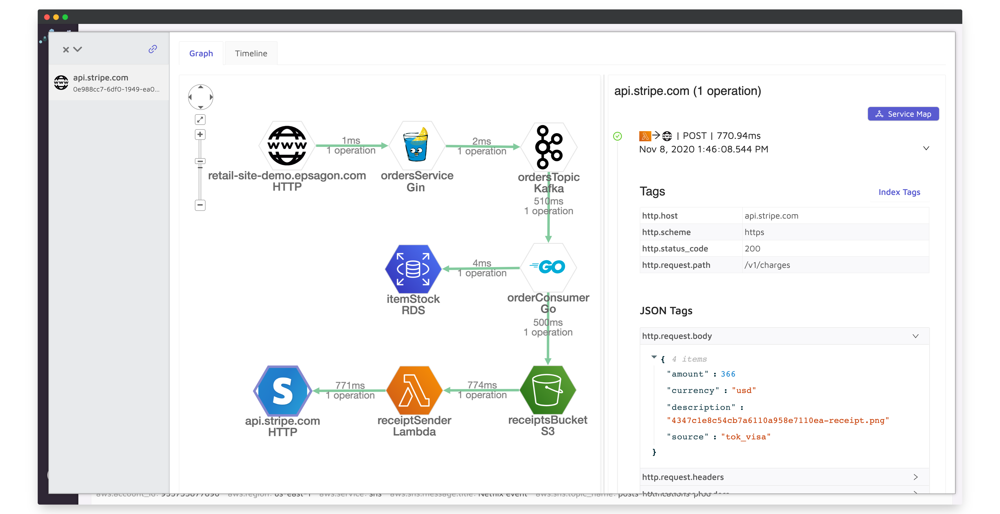

<p align="center">
  <a href="https://epsagon.com" target="_blank" align="center">
    
  </a>
  <br />
</p>

[](https://travis-ci.com/epsagon/epsagon-go)
[](https://godoc.org/github.com/epsagon/epsagon-go)

# Epsagon Tracing for Go




This package provides tracing to Go applications for the collection of distributed tracing and performance metrics in [Epsagon](https://app.epsagon.com/?utm_source=github).


## Contents

- [Installation](#installation)
- [Usage](#usage)
  - [Tagging Traces](#tagging-traces)
  - [Custom Errors](#custom-errors)
  - [Ignored Keys](#ignored-keys)
- [Frameworks](#frameworks)
- [Integrations](#integrations)
- [Configuration](#configuration)
- [Getting Help](#getting-help)
- [Opening Issues](#opening-issues)
- [License](#license)


## Installation

To install Epsagon, simply run:
```sh
go get github.com/epsagon/epsagon-go
```

Or using `dep`:
```sh
dep ensure -add github.com/epsagon/epsagon-go
```

## Usage

### Tagging Traces

You can add custom tags to your traces, for easier filtering and aggregations.

Add the following call inside your code:
```go
epsagon.Label("key", "value")
epsagon.Label("user_id", user_id)
```

You can also use it to ship custom metrics:
```go
epsagon.Label("key", "metric")
epsagon.Label("items_in_cart", items_in_cart)
```

Valid types are `string`, `bool`, `int` and `float`.
Custom labels are not trimmed with the trace events in case the trace is too big

### Custom Errors

You can set a trace as an error (although handled correctly) to get an alert or just follow it on the dashboard.
Add the following call inside your code:
```go
epsagon.TypeError("My custom error", "Custom Error Type")
# Or manually add an error
epsagon.TypeError(errors.New("My custom error"), "Custom Error Type")
```

You can also set a tracer as an error with a default error type:
```go
epsagon.Error("My custom error")
# Or manually add an error
epsagon.Error(errors.New("My custom error"))
```

Valid types are `string` and `error`.

### Ignored Keys

You can set keys that will be masked in the sent trace from the events metadata to hide selected information:
```go
	config.IgnoredKeys = []string{"password"}
	client := http.Client{Transport: epsagonhttp.NewTracingTransport(ctx)}
	// This password will be masked in the sent trace:
	decodedJSON, err := json.Marshal(map[string]string{"password": "abcde", "animal": "lion"})
	resp, err := client.Post("http://example.com/upload", "application/json", bytes.NewReader(decodedJSON))
```

## Frameworks

The following frameworks are supported by Epsagon:

|Framework                               |Supported Version          |
|----------------------------------------|---------------------------|
|[AWS Lambda](#aws-lambda)               |All                        |
|[Generic Function](#generic)            |All                        |
|[HTTP](#http)                           |All                        |
|[Gin](#gin)                             |All                        |
|[Fiber](#fiber)                         | >= 2.11.0                 |
|[go-redis](#go-redis)                   | >= 8.0.0                  |
|[mongo](#mongo)                         |>=1.0                      |


### AWS Lambda

Tracing Lambda functions can be done in the following method:

```go
package main

import (
	"github.com/aws/aws-lambda-go/events"
	"github.com/aws/aws-lambda-go/lambda"
	"github.com/epsagon/epsagon-go/epsagon"
	"log"
)

func myHandler(request events.APIGatewayProxyRequest) (events.APIGatewayProxyResponse, error) {
	log.Println("In myHandler, received body: ", request.Body)
	return events.APIGatewayProxyResponse{Body: request.Body, StatusCode: 200}, nil
}

func main() {
	log.Println("enter main")
	lambda.Start(epsagon.WrapLambdaHandler(
        epsagon.NewTracerConfig("app-name-stage","epsagon-token"),
        myHandler))
}
```

### Generic

You can instrument a single function, this function can use go routines inside and their operations will still be traced.

```go
func doTask(a int, b string) (int, error) {
	log.Printf("inside doTask: b = %s", b)
	return a + 1, fmt.Errorf("boom")
}
func main() {
	// With Epsagon instrumentation
	config := epsagon.NewTracerConfig("generic-go-wrapper", "")
	config.Debug = true
	response := epsagon
	
	.GoWrapper(config, doTask)(5, "hello")
	res2 := response[0].Int()
	errInterface := response[1].Interface()
}
```
Optionally, you can pass a custom name for your wrapped function. In the epsagon dashboard,
your wrapped function will be displayed with your configured name in all the relevant screens:
traces search, service map and more.
```
	response := epsagon.GoWrapper(config, doTask, "<MyInstrumentedFuncName>")(5, "hello")
```

### Concurrent Generic
In order to support more than one function being traced in the same environment (using different goroutines), use this wrapper as shown in the example below. The wrapped function has to receive a context as its first parameter, and pass it to the relevant wrapped operations.


```go
func doTask(ctx context.Context, a int, b string, wg *sync.WaitGroup) (int, error) {
	defer wg.Done()
	log.Printf("inside doTask: b = %s", b)
	client := epsagonhttp.Wrap(http.Client{}, ctx)
	client.Get("https://epsagon.com/")
	return a + 1, fmt.Errorf("boom")
}

func main() {
	config := epsagon.NewTracerConfig("generic-go-wrapper", "")
	config.Debug = true
	var wg sync.WaitGroup
	for i := 0; i < 5; i++ {
		go epsagon.ConcurrentGoWrapper(config, doTask)(i, "hello", &wg)
	}
	wg.Wait()
	time.Sleep(2 * time.Second)
}
```
Optionally, you can pass a custom name for your wrapped function. In the epsagon dashboard,
your wrapped function will be displayed with your configured name in all the relevant screens:
traces search, service map and more.
```
		go epsagon.ConcurrentGoWrapper(config, doTask, "<MyInstrumentedFuncName>")(i, "hello", &wg)
```

### http

Wrapping http handlers with Epsagon:
```go
import (
	"github.com/epsagon/epsagon-go/epsagon"
	epsagonhttp "github.com/epsagon/epsagon-go/wrappers/net/http"
)

func main() {
	mux := http.NewServeMux()
	mux.HandleFunc("/ping", epsagonhttp.WrapHandleFunc(
		epsagon.NewTracerConfig("test-http-mux", ""),
		func(rw http.ResponseWriter, req *http.Request) {
			epsagon.Error("Ping Endpoint Called", req.Context())
			rw.Write([]byte("Pong.\n"))
		}),
        "my-handler-name",
	)

	http.ListenAndServe(":8080", mux)
}
```

The third and fourth arguments to `epsagonhttp.WrapHandleFunc` are optional and set the resource name and the hostname. If the resource name is not set then the wrapped funcdtion name is used and the hostname is taken from the request URL if omitted.
```go
	mux.HandleFunc("/ping", epsagonhttp.WrapHandleFunc(
		epsagon.NewTracerConfig("test-http-mux", ""),
		func(rw http.ResponseWriter, req *http.Request) {
			epsagon.Error("Ping Endpoint Called", req.Context())
			rw.Write([]byte("Pong.\n"))
		}),
        "my-handler-name",
		"test.hostname.com",
	)
```

To wrap nested libraries you can get the epsagon context from the request context:
```go
client := http.Client{
    Transport: epsagonhttp.NewTracingTransport(req.Context())}
resp, err := client.Get("http://example.com")
```

### gin

You can easily instrument gin applications with Epsagon:

```go
import (
	"github.com/epsagon/epsagon-go/epsagon"
	epsagongin "github.com/epsagon/epsagon-go/wrappers/gin"
	"github.com/gin-gonic/gin"
)

func main() {
	r := epsagongin.GinRouterWrapper{
		IRouter:  gin.Default(),
		Hostname: "my_site",
        Config:   epsagon.NewTracerConfig(
        "test-gin-application", "",
        ),
	}

	r.GET("/ping", func(c *gin.Context) {
		c.JSON(200, gin.H{
			"message": "pong",
		})
	})
	r.IRouter.(*gin.Engine).Run()
```

If you want to instument other integrated libraries inside the gin handler you can get the Epsagon context from the gin.Context to do that:

```go
client := http.Client{
    Transport: epsagonhttp.NewTracingTransport(epsagongin.EpsagonContext(c))}
resp, err := client.Get("http://example.com")
```

### fiber

You can easily instrument fiber applications with Epsagon middleware:

```go
import (
	"github.com/epsagon/epsagon-go/epsagon"
	epsagonfiber "github.com/epsagon/epsagon-go/wrappers/fiber"
	"github.com/gofiber/fiber/v2"
)

func main() {
	config := epsagon.NewTracerConfig(
		"fiber-example", "",
	)
	config.MetadataOnly = false
	app := fiber.New()
	// Match all routes
	epsagonMiddleware := &epsagonfiber.FiberEpsagonMiddleware{
		Config: config,
	}
	app.Use(epsagonMiddleware.HandlerFunc())
	app.Post("/", func(c *fiber.Ctx) error {
		return c.SendString("Hello, World 👋!")
	})

	app.Listen("0.0.0.0:3000")
}
app.Post("/", func(c *fiber.Ctx) error {
		return c.SendString("Hello, World 👋!")
	})
```

If you want to instument other integrated libraries inside the fiber handler you can get the Epsagon context from the fiber.Ctx UserContext function to do that:

```go
client := http.Client{
	Transport: epsagonhttp.NewTracingTransport(c.UserContext()
	)}
resp, err := client.Get("http://example.com")
```

### go-redis

The go-redis instrumentation supports both single and pipeline operations ([full example](https://github.com/epsagon/epsagon-go/tree/master/example)):

```go
func main() {
	config := epsagon.NewTracerConfig("redis-wrapper-test", "")
	config.MetadataOnly = false

	mux := http.NewServeMux()
	mux.HandleFunc("/ping", epsagonhttp.WrapHandleFunc(
		config,
		func(w http.ResponseWriter, req *http.Request) {
			// initialize the redis client as usual
			// make sure to pass in the epsagon tracer context
			rdb := epsagonredis.NewClient(&redis.Options{
				Addr:     "localhost:6379",
				Password: "",
				DB:       0,
			}, req.Context())

			value, _ := rdb.Get(context.Background(), "somekey").Result()
			io.WriteString(w, value)
		}),
	)
	http.ListenAndServe(":8080", mux)
}
```

### mongo

Trace through all Mongo collection operations by wrapping the Collection:

```go

package main

import (
	"context"
	"github.com/epsagon/epsagon-go/epsagon"
	epsagonmongo "github.com/epsagon/epsagon-go/wrappers/mongo"
	"time"

)


func main() {

	ctx, cancel := context.WithTimeout(context.Background(), 30*time.Second)
	defer cancel()
	client, err := mongo.Connect(
		ctx,
		options.Client().ApplyURI("mongodb://..."),
	)
	defer func() {
		if err = client.Disconnect(ctx); err != nil {
			panic(err)
		}
	}()

	db := client.Database("DB")
	coll := epsagonmongo.WrapMongoCollection(
		db.Collection("COLL"),
	)
}

```

## Integrations

Epsagon provides out-of-the-box instrumentation (tracing) for many popular frameworks and libraries.

|Library              |Supported Version          |
|---------------------|---------------------------|
|[net/http](#net/http)|Fully supported            |
|aws-sdk-go           |`>=1.10.0`                 |
|aws-sdk-go-v2        |`>=0.23.0`                 |


### net/http

Any http request can be traced using a custom RoundTripper implementation and using that in an http.Client:

```go
import (
	"github.com/epsagon/epsagon-go/wrappers/net/http"
...
	client := http.Client{Transport: epsagonhttp.NewTracingTransport()}
	resp, err := client.Get(anyurl)
```

If you are already using a custom RoundTripper implementation, such as for AWS V4 request signing, you can wrap it:

```go
import (
	"github.com/epsagon/epsagon-go/wrappers/net/http"
...
	rt := &custom.Roundtripper{}
	client := http.Client{Transport: epsagonhttp.NewWrappedTracingTransport(rt)}
	resp, err := client.Get(anyurl)
```

The wrapped http.Client functionality exists for backwards compatibility:

```go
import (
	"github.com/epsagon/epsagon-go/wrappers/net/http"
...
	client := epsagonhttp.Wrap(http.Client{})
	resp, err := client.Get(anyurl)
```

If you want to disable data collection only for the calls made by this client set  `client.MetadataOnly = true`

### aws-sdk-go

Wrapping of aws-sdk-go is done through the Session object that has to be created to communicate with AWS:

```go
import (
...
	"github.com/epsagon/epsagon-go/wrappers/aws/aws-sdk-go/aws"
)
    ...
	sess := epsagonawswrapper.WrapSession(session.Must(session.NewSession()))
	svcSQS := sqs.New(sess)
```


### aws-sdk-go-v2

Wrapping of aws-sdk-go-v2 is done through the service object:
```go
import (
...
	"github.com/aws/aws-sdk-go-v2/service/dynamodb"
	"github.com/epsagon/epsagon-go/epsagon"
)

	svc := epsagon.WrapAwsV2Service(dynamodb.New(cfg)).(*dynamodb.Client)
    ...
```


## Configuration

Advanced options can be configured as a parameter to the `Config` struct to the `WrapLambdaHandler` or as environment variables.

|Parameter             |Environment Variable                |Type   |Default      |Description                                                                        |
|----------------------|------------------------------------|-------|-------------|-----------------------------------------------------------------------------------|
|Token                 |EPSAGON_TOKEN                       |String |-            |Epsagon account token                                                              |
|ApplicationName       |-                                   |String |-            |Application name that will be set for traces                                       |
|MetadataOnly          |EPSAGON_METADATA                    |Boolean|`true`       |Whether to send only the metadata (`True`) or also the payloads (`False`)          |
|CollectorURL          |EPSAGON_COLLECTOR_URL               |String |-            |The address of the trace collector to send trace to                                |
|Debug                 |EPSAGON_DEBUG                       |Boolean|`False`      |Enable debug prints for troubleshooting                                            |
|SendTimeout           |EPSAGON_SEND_TIMEOUT_SEC            |String |`1s`         |The timeout duration to send the traces to the trace collector                     |
|MaxTraceSize          |EPSAGON_MAX_TRACE_SIZE              |Integer|`1287936`    |The max allowed trace size (in bytes). Defaults to 64KB, max allowed size - 512KB  |
|_                     |EPSAGON_LAMBDA_TIMEOUT_THRESHOLD_MS |Integer|`200`        |The threshold in milliseconds to send the trace before a Lambda timeout occurs     |


## Getting Help

If you have any issue around using the library or the product, please don't hesitate to:

* Use the [documentation](https://docs.epsagon.com).
* Use the help widget inside the product.
* Open an issue in GitHub.


## Opening Issues

If you encounter a bug with the Epsagon library for Go, we want to hear about it.

When opening a new issue, please provide as much information about the environment:
* Library version, Go runtime version, dependencies, etc.
* Snippet of the usage.
* A reproducible example can really help.

The GitHub issues are intended for bug reports and feature requests.
For help and questions about Epsagon, use the help widget inside the product.

## License

Provided under the MIT license. See LICENSE for details.

Copyright 2020, Epsagon
